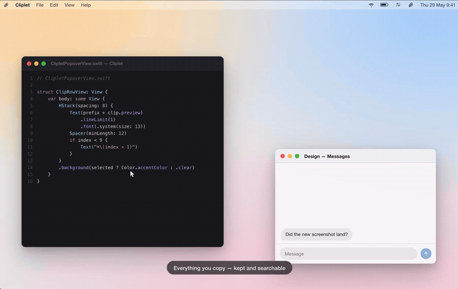

<!-- Cliplet README. Images live in docs/images/. Interactive demo source: demo/index.html (hosted at https://eplugge.github.io/Cliplet/). -->

<h1 align="center">Cliplet</h1>

<p align="center">
  <strong>Paste from the past.</strong><br>
  A fast, native macOS menu-bar clipboard history.
</p>

<p align="center">
  <a href="https://github.com/eplugge/Cliplet/releases/latest"></a>
  
  
  <a href="LICENSE"></a>
</p>

<p align="center">
  <em>Cliplet quietly remembers what you copy — text, links, images, files — and lets you<br>
  search and re-paste any of it from a keyboard-driven menu-bar popover.</em>
</p>

<p align="center">
  
</p>

<p align="center">
  <sub><em>▶ <a href="https://eplugge.github.io/Cliplet/">Try the interactive demo</a></em></sub>
</p>

---

## Features

- **Lightweight menu-bar app** — no Dock icon, native SwiftUI/AppKit. Left-click for the
  history popover, right-click for a quick command menu.
- **Searchable history** — type to filter (matches both contents and aliases), click or
  `Return` to copy a clip back.
- **Quick Look previews** — `Space` previews any clip, text included.
- **Pin, promote & reorder** — pin the clips you reuse and drag them into a manual order;
  recent and reused clips bubble to the top; `⌘1`–`9` copy your top clips.
- **Aliases** — label any clip (e.g. *"work login"*) from the Edit modal.
- **Privacy controls** — blur or hide a clip's contents, exclude chosen apps, hide Cliplet
  during screen sharing, and capture into throwaway temporary sessions. See [Privacy](#privacy).
- **Pause capture** — stop recording the clipboard with one click when you don't want it.
- **Auto-paste (optional)** — paste straight into the previous app (Homebrew / direct-download
  build only; needs Accessibility permission).
- **Tunable** — configurable history size, visible rows, max clip size, and whether new clips
  land at the top or the bottom.
- **Light & dark** — native materials follow your system appearance.

## Privacy

Everything stays on your Mac — Cliplet has **no account, no network, and no telemetry**.
Beyond that, it gives you several ways to keep sensitive clips under control:

- **Blur or hide clips** — mask a clip behind a blur or a placeholder and reveal it on demand;
  choose how many leading and trailing characters stay visible.
- **Aliases & display modes** — label a clip and set it to Show, Blur, or Hide from the Edit
  modal, independent of pinning.
- **Per-app exclusions** — never capture from the apps you choose (e.g. your password manager).
- **Hide during screen sharing** — keep the popover and Preferences out of screen recordings
  and shared screens.
- **Temporary sessions** — capture into an ephemeral session whose clips are marked with an
  hourglass, discarded when you end it (with a *Keep All* option), and purged on next launch.

## Install

**Mac App Store:** [Download Cliplet](https://apps.apple.com/app/id6774704932) — sandboxed
build (auto-paste is available only in the Homebrew/direct-download build below).

**Homebrew:**

```sh
brew install --cask eplugge/tap/cliplet
```

**Direct download:** grab `Cliplet-x.y.z.dmg` from the
[latest release](https://github.com/eplugge/Cliplet/releases/latest), open it, and drag
Cliplet to Applications.

## Permissions

Auto-paste synthesizes `⌘V` into the previous app, which needs **Accessibility** access:
**System Settings → Privacy & Security → Accessibility → enable Cliplet**. Everything else
(history, search, manual copy) works without it.

## Keyboard shortcuts

| Key | Action |
| --- | --- |
| `↑` / `↓` | Move selection |
| `Page Up` / `Page Down` | Jump a page |
| `Home` / `End` | First / last clip |
| `Return` | Copy selected clip |
| `Space` | Quick Look preview (toggle) |
| `⌘1` – `⌘9` | Copy clip 1–9 |
| `⌦` (forward delete) | Delete selected clip (press twice to confirm) |
| `Esc` | Close |

## Build from source

```sh
swift build         # debug build
swift run Cliplet    # run from source
swift test          # run the test suite
```

To produce a distributable app: `Scripts/build-app.sh` (unsigned) or `Scripts/release.sh`
(signed + notarized DMG; requires a Developer ID cert and a `cliplet-notary` notarytool profile).

## License

[GPL-3.0](LICENSE). Free to use, modify, and share; derivatives must remain open under GPL.
