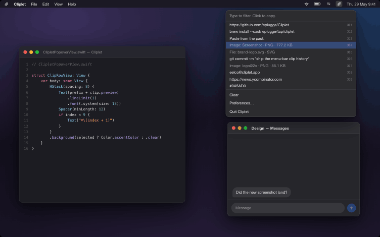
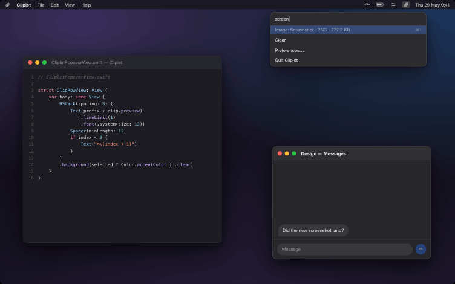
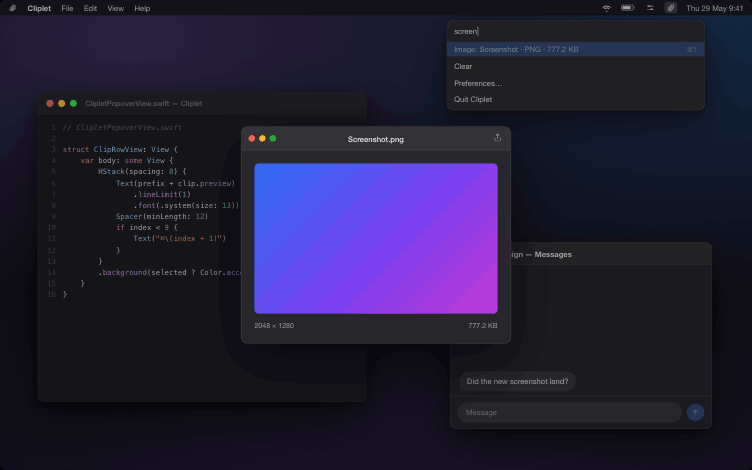
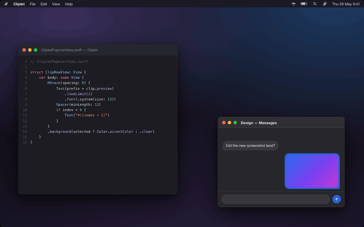
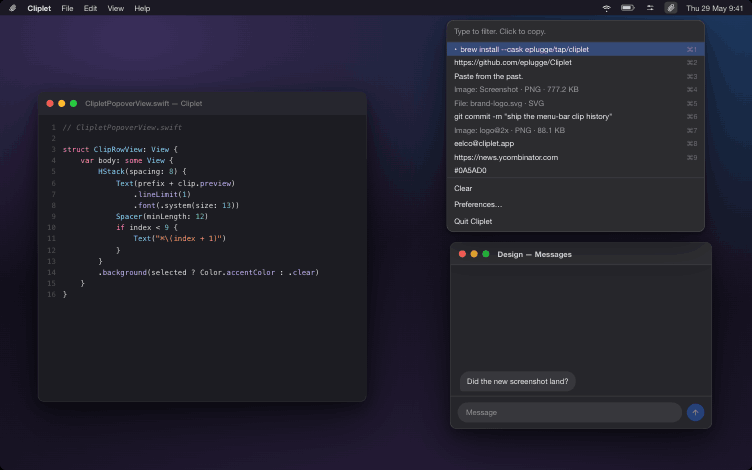
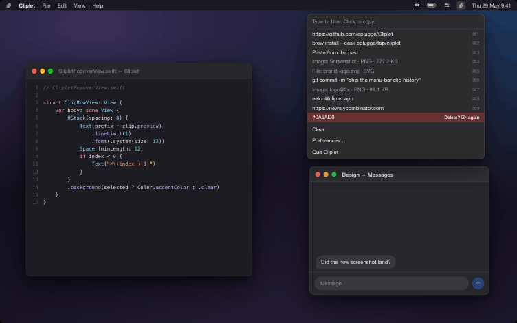
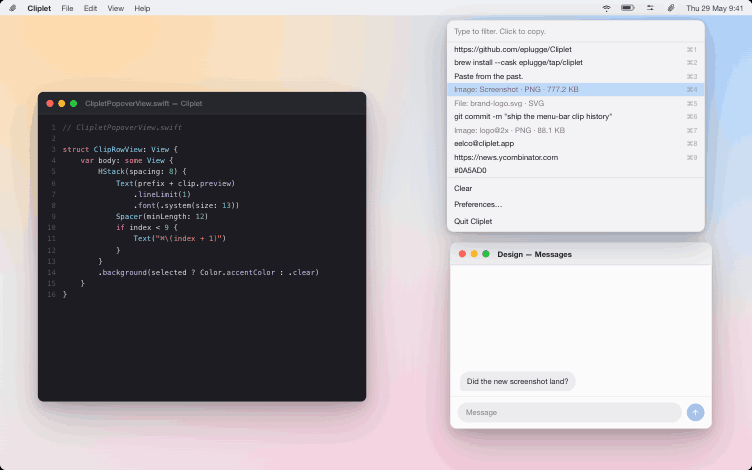

<!-- Cliplet README. Images live in docs/images/ (generated from demo/Cliplet Demo.html). -->

<h1 align="center">Cliplet</h1>

<p align="center">
  <strong>Paste from the past.</strong><br>
  A fast, native macOS menu-bar clipboard history.
</p>

<p align="center">
  <a href="https://github.com/eplugge/Cliplet/releases/latest"></a>
  
  
  <a href="LICENSE"></a>
</p>

<p align="center">
  
</p>

<p align="center">
  <em>Cliplet quietly remembers what you copy — text, links, images, files — and lets you<br>
  search and re-paste any of it from a keyboard-driven menu-bar popover.</em>
</p>

<p align="center">
  
</p>

<p align="center">
  <sub><em>Prefer it interactive? Open <a href="demo/Cliplet%20Demo.html"><code>demo/Cliplet&nbsp;Demo.html</code></a> in any browser.</em></sub>
</p>

---

## How it works

<table>
  <tr>
    <td width="50%" valign="top">
      <br>
      <strong>Type to filter.</strong> Start typing the moment the popover opens — the list narrows to
      what you mean.
    </td>
    <td width="50%" valign="top">
      <br>
      <strong>Space to preview.</strong> Quick Look any clip — including images and text — without
      leaving the keyboard.
    </td>
  </tr>
  <tr>
    <td width="50%" valign="top">
      <br>
      <strong>Click to copy, ⌘V to paste.</strong> The clip goes back on the pasteboard, ready for the
      app you were just in.
    </td>
    <td width="50%" valign="top">
      <br>
      <strong>Pin what you reuse.</strong> Pinned clips (•) stick to the top; used clips bubble up.
    </td>
  </tr>
  <tr>
    <td width="50%" valign="top">
      <br>
      <strong>Prune in place.</strong> Forward-delete removes a clip — press twice to confirm.
    </td>
    <td width="50%" valign="top">
      <br>
      <strong>Light &amp; dark.</strong> Native materials follow your system appearance.
    </td>
  </tr>
</table>

---

## Features

- **Lightweight menu-bar app** — no Dock icon, native SwiftUI/AppKit.
- **Searchable history** — type to filter, click (or `Return`) to copy a clip back.
- **Quick Look previews** — `Space` previews any clip, text included.
- **Pin & promote** — pin clips, move-used-to-top, `⌘1`–`9` quick paste.
- **Auto-paste (optional)** — paste straight into the previous app (needs Accessibility permission).
- **Per-app exclusions** — secrets from chosen apps are never captured.
- **Tunable** — configurable history size, visible rows, and max clip size.

## Install

**Homebrew (recommended):**

```sh
brew install --cask eplugge/tap/cliplet
```

**Direct download:** grab `Cliplet-x.y.z.dmg` from the
[latest release](https://github.com/eplugge/Cliplet/releases/latest), open it, and drag
Cliplet to Applications.

## Permissions

Auto-paste synthesizes `⌘V` into the previous app, which needs **Accessibility** access:
**System Settings → Privacy & Security → Accessibility → enable Cliplet**. Everything else
(history, search, manual copy) works without it.

## Keyboard shortcuts

| Key | Action |
| --- | --- |
| `↑` / `↓` | Move selection |
| `Page Up` / `Page Down` | Jump a page |
| `Home` / `End` | First / last clip |
| `Return` | Copy selected clip |
| `Space` | Quick Look preview (toggle) |
| `⌘1` – `⌘9` | Copy clip 1–9 |
| `⌦` (forward delete) | Delete selected clip (press twice to confirm) |
| `Esc` | Close |

## Build from source

```sh
swift build         # debug build
swift run Cliplet    # run from source
swift test          # run the test suite
```

To produce a distributable app: `Scripts/build-app.sh` (unsigned) or `Scripts/release.sh`
(signed + notarized DMG; requires a Developer ID cert and a `cliplet-notary` notarytool profile).

## License

[GPL-3.0](LICENSE). Free to use, modify, and share; derivatives must remain open under GPL.
